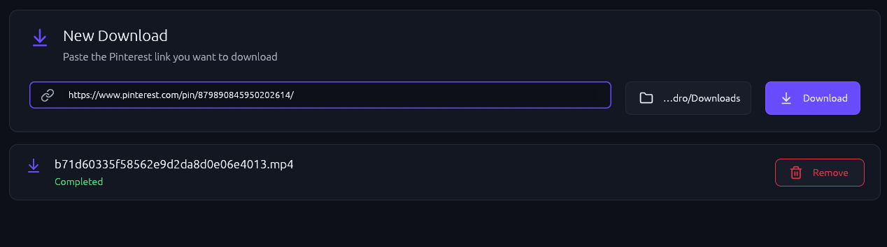

# Pinterest Downloader

[![MIT License][license-badge]][license-url]
[![Rust 1.85+][rust-badge]][rust-url]

[license-badge]: https://img.shields.io/badge/license-MIT-blue.svg
[license-url]: https://github.com/pedrogiudici/pinterest-downloader/blob/main/LICENSE
[rust-badge]: https://img.shields.io/badge/rust-1.85+-dea584.svg
[rust-url]: https://blog.rust-lang.org/2025/02/20/Rust-1.85.0.html

> A Pinterest video downloader written in Rust — CLI and native GUI (egui).

## Screenshot



## Features

- Automatic `.mp4` URL extraction from Pinterest pins
- Command-line interface (CLI) for quick downloads
- Native graphical interface (GUI via egui) with folder picker
- Concurrent downloads with real-time status feedback

## Usage

**CLI:**
```bash
# Download to current directory
cargo run --bin pinterest-dl -- https://br.pinterest.com/pin/123

# Download to a specific folder
cargo run --bin pinterest-dl -- https://br.pinterest.com/pin/123 ~/Downloads
```

**GUI:**
```bash
cargo run --bin pinterest-dl-gui
```

## Building

```bash
# Prerequisites: Rust 1.85+ (edition 2024)

# Build everything
cargo build --release

# Build only CLI
cargo build --release -p pinterest-dl

# Build only GUI
cargo build --release -p pinterest-dl-gui
```

## Tests

```bash
cargo test
```

## Project Structure

```
pinterest-dl-core/    Core logic: URL extraction, download, event system
pinterest-dl/         Terminal interface
pinterest-dl-gui/     Native GUI (egui + eframe)
```

## Contributing

- TDD: tests required for new features and bug fixes.
- Keep modules small with clear responsibilities.
- See [CONTRIBUTING.md](CONTRIBUTING.md) for details.

## License

This project is licensed under the MIT License — see the [LICENSE](LICENSE) file.
